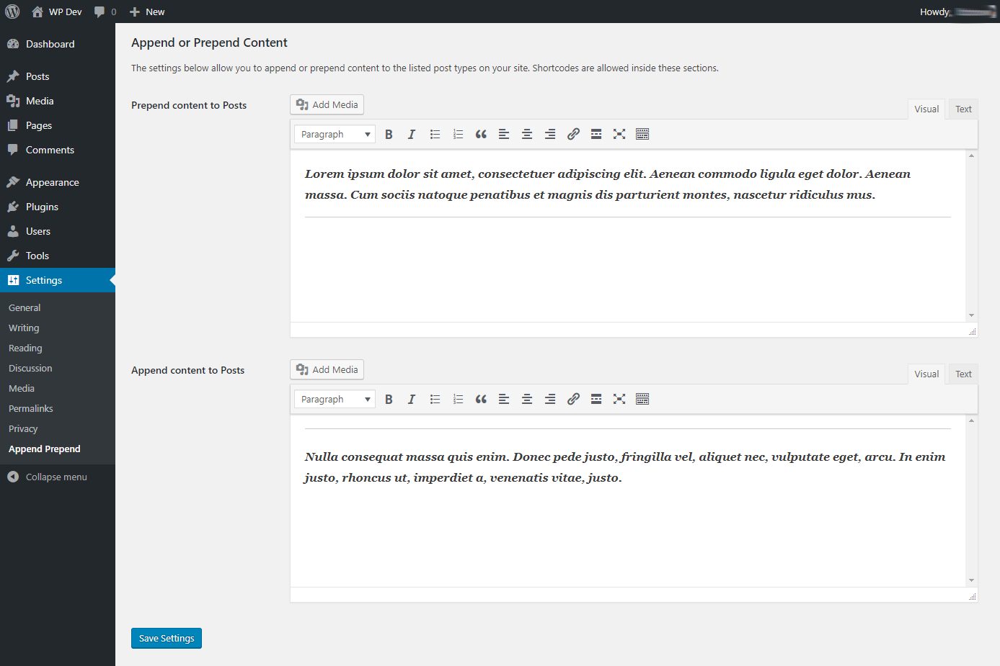
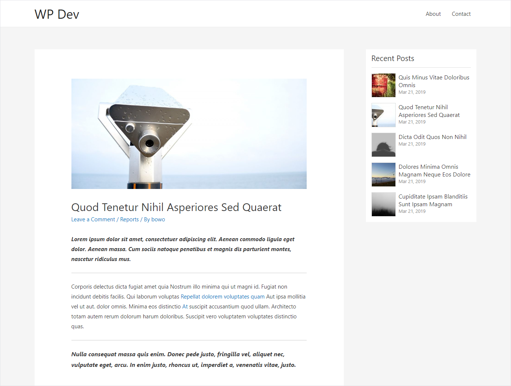

# Description

This plugin allows you to append or prepend content to posts and custom post types on your site.

It is created using [WordPress Plugin Boilerplate](https://github.com/DevinVinson/WordPress-Plugin-Boilerplate).

## Screenshots

